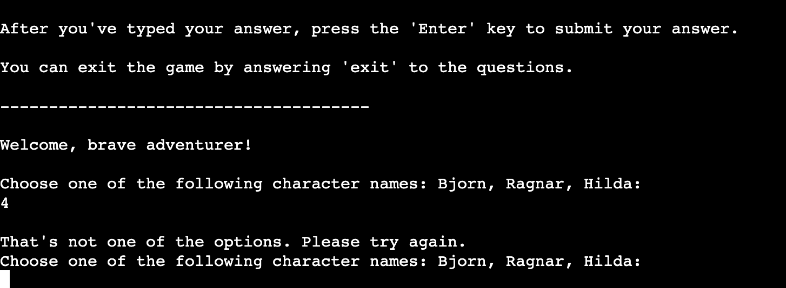
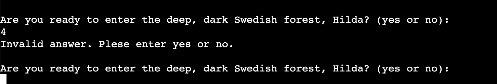
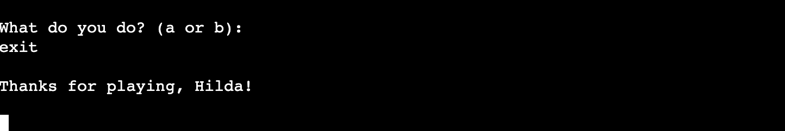
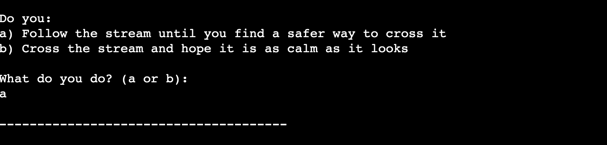
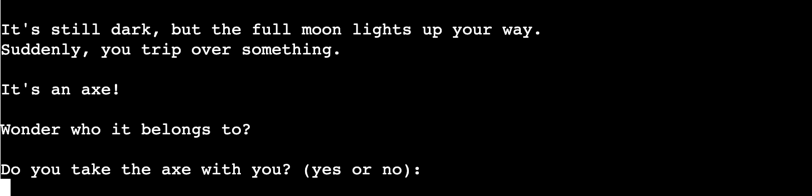
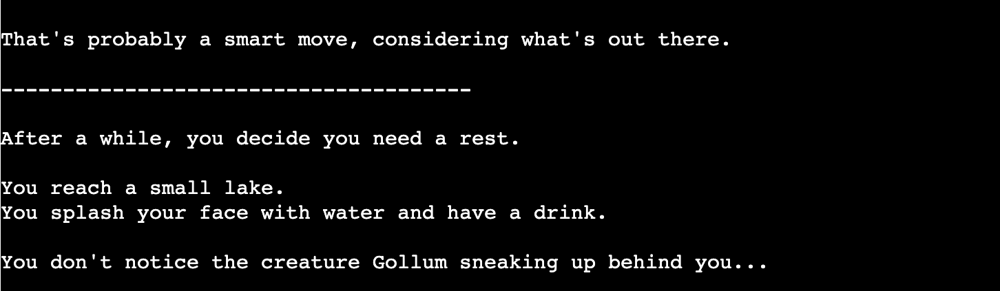
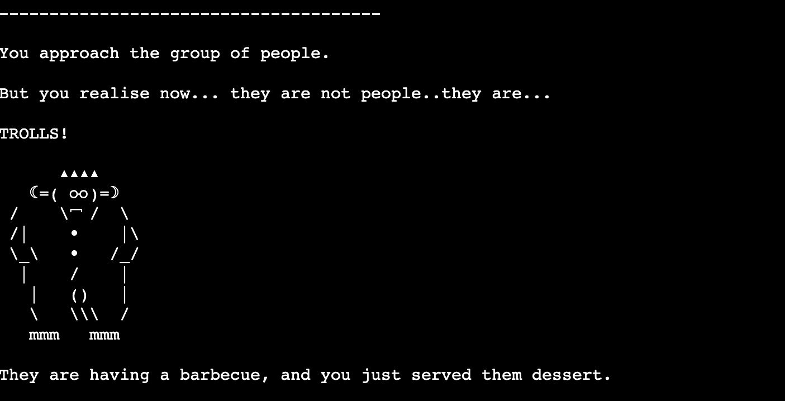
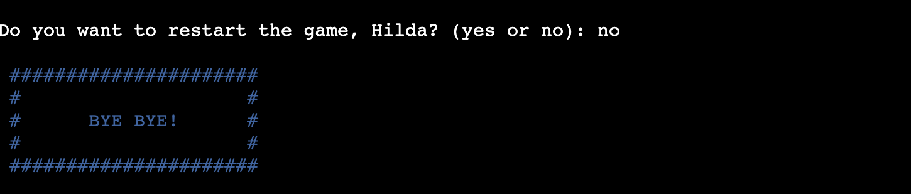

# **Swedish Forest Text Adventure Game**
## **Description**
The game is a text-based adventure game where the player is tasked with answering questions and riddles to progress through the game. The player will encounter various scenarios and meet different creatures. The end goal is to make it out of the forest.  

### *How to play*
The game begins with an introduction where the player is given some background information about the game and the quest they are embarking on. The player is then presented with a series of questions and riddles that they must answer correctly to progress in the game. If they choose the correct answer, they move on to the next question/riddle. If they choose the wrong answer, they lose the game and can choose to start over. The player can also choose to exit the game at any time by answering "exit" on the questions/riddles.

In addition, the game keeps track of whether the player has picked up an axe. In the final question (when the player encounters a dwarf) the outcomes differs depending on if the player picked up the axe or not. This question follows a different procedure than the previous ones. The player will not lose if they answer wrong, but they will be taken back to the lake where they must answer another riddle. If they answer the riddle correctly, another final question is displayed, where the "random" factor has been implemented to give the game a twist.

## *Flow chart*
The flow chart was created to provide a clear visual representation of how I wanted the game to progress based on the player's answers. It helped me design the game and its functions more effectively, without getting lost in the code. I have revised the flow chart a few times as new ideas and functions were added to the game.

## **Features**
### *Choose character name*
 Lets the player choose their character's name before the game begins. The function starts with instructions on how to play the game. If the player chooses a valid name, the game proceeds to the next function. If the player types an invalid name, they are prompted to choose a name again until they choose a valid one.

 
### *Are you ready?*
Asks the player if they are ready to play the game and displays an introduction if they answer yes. If they answer no, the game ends. 
If the player answers an invalid answer, they are prompted to enter yes or no. 

### *Exit game early*
This function is called if the player chooses to exit the game at any stage by answering "exit" on the question/riddle. It prints a goodbye message that includes the characters' name. The "sys.exit()" command is used to immediately terminate the game. 

### *Choose answer*
The player is always presented with two answer options to choose from (except in the function second_final_question). 
They select their answer by typing it in the console, and the game then evaluates their response and proceeds accordingly. 
In the second final question, the player has to enter "flip" to flip the coin and continue the game.

### *Improve chance of victory*
The third question function gives the player the option to pick up an axe.
This can either improve their chances of victory or not, depending on what they choose. 
The function displays different messages depending on if the player picks up the axe or not, but both answeres lead to the first riddle function.

### *Correct answer declaration*
Whenever the player answers correctly, the game will either acknowledge that it was the correct answer or continue the story, indicating to the player that they are making progress.

### *Wrong answer declaration*
Whenever the player answers wrong, the game will acknowledge that it was the wrong answer by displaying a message suitable for the answer to the question/riddle. 

### *Game over message*
The game over message will display after the wrong answer declaration and will let the player know its game over. 

### *Restart game message*
After displaying the "Game Over" message the player is asked to choose whether they want to restart the game or not. If they choose "yes", the game restarts from the beginning. If they choose "no", the "exit game" message is displayed before the game is terminated. 

## **Testing**
### *Unfixed bugs*

## **Deployment**
### *Version Control*
The git commands below were used throughout development to push code to the remote repository in GitHub:
- `git add .` - This command was used to add a change in the working directory to the staging area
- `git commit -m "message"` -This command was used to save changes to the local repository. A brief description of what has changed and when
- `git push` - This command was used to push all commits to the remote repository on GitHub
### *Deploy to Heroku*
- Open the Heroku website and select "New" to create a new app. 
- After choosing a name for the new app, and selecting the correct region, click on "Create app". 
- Navigate to "Settings" and go to the Config Vars section. Add a Config Var with the keyword "PORT" and 
value of "8000". 
- Still in "Settings", go to Buildpacks and add the buildpacks for Python and NodeJS, in that order. 
- Navigate to the top menu and go to "Deploy". Scroll down and set the Deployment Method to "Github". 
Once Github is selected, locate your repository and link it to Heroku. 
- Scroll down to Manual Deploy, ensure that the "main" branch is selected, and click "Deploy Branch".
- You will see the text "Your app was successfully deployed.". Click the button "View" to open the link to your
deployed app. 
## **Credits**
- Code Institute LMS
- Slack
- My mentor Daisy McGirr
- https://pypi.org/project/colorama/
- The text adventure game is in some parts inspired by Lord of The Rings
- All three riddles is taken from "The Hobbit: An Unexpected Journey"

Inspiration was taken from 
- https://www.askpython.com/python/text-based-adventure-game
- https://www.thecoderpedia.com/blog/text-based-adventure-game-in-python/
- https://www.youtube.com/watch?v=u8X6TiJA8as
- https://github.com/OlgaJ1989/text_adventure/blob/main/run.py

Help and guidance when I encountered problems I didn't know how to solve myself
- https://www.w3schools.com/python/ 
- https://stackoverflow.com/questions/2070684/how-can-i-make-my-python-code-stay-under-80-characters-a-line
- https://stackoverflow.com/questions/15435811/what-is-pep8s-e128-continuation-line-under-indented-for-visual-indent
- https://www.programiz.com/python-programming/break-continue
- https://stackoverflow.com/questions/33466860/expected-two-blank-lines-pep8-warning-in-python
- https://pythonprogramminglanguage.com/try-except/